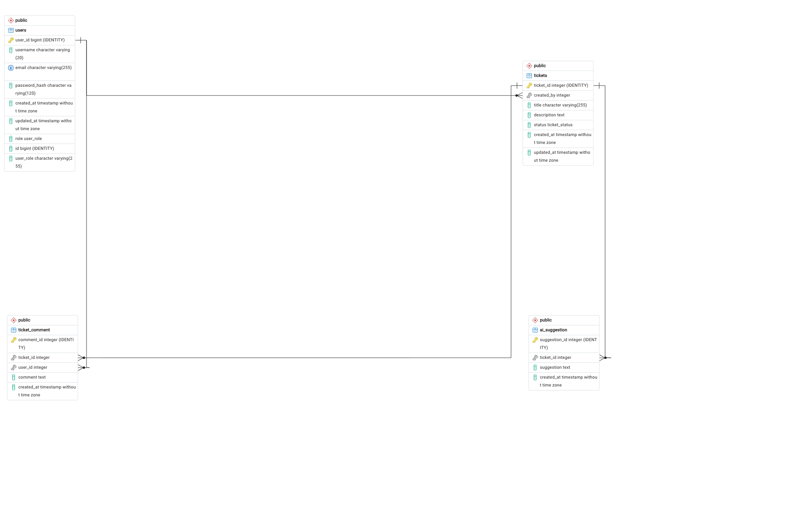

# AI-Deskhelp

[](#) [](#)

AI-Deskhelp is a lightweight, AI-powered IT helpdesk that answers user questions from FAQ markdown files via RAG, and escalates unclear cases to human support.

## Features
- Chat UI for users to ask IT support questions.
- Retrieval-Augmented Generation over FAQ markdown files.
- LLM answers with cited context; falls back to human support on low confidence.
- Ticket creation and tracking for escalations.
- Persistent storage of chats, tickets, and retrieval metadata.

## Why this project?
- Practice a practical AI product: combines RAG + LLM + human-in-the-loop.
- Learn end-to-end delivery: frontend, backend orchestration, vector search, and persistence.
- Show real-world relevance: mirrors how support teams blend AI self-service with human escalation.

## Architecture Overview
See `docs/architecture.md` for the Mermaid diagram and detailed component notes. The design uses a modular monolith backend to keep the MVP simple and buildable.

## Tech Stack ( MVP)
- Frontend: React + TypeScript (Vite)
- Backend: FastAPI (Python) or Express.js (Node) — pick one for the monolith
- Database: PostgreSQL (SQLite acceptable for local dev)
- Vector Store: FAISS (local) or SQLite-based embeddings index
- LLM: Hosted API (e.g., OpenAI GPT-4/5) with retrieval context

## How It Works (happy path and fallback)
1. User asks a question in the Chat UI.
2. Backend API stores the message and calls the RAG module.
3. RAG retrieves top FAQ chunks from the vector store.
4. LLM generates an answer using the retrieved context and returns confidence.
5. If confident: API sends the AI reply to the user and logs it.
6. If low confidence/no context: API creates a ticket, notifies Human Support, and returns an escalated status to the user.
7. Human Support replies via the console; the response is delivered back to the user through the same chat.

## Setup (local, minimal)

```bash
git clone https://github.com/Rashids10/AI-Deskhelp.git && cd ai-helpdesk
```


## Start Spring Boot Backend

### Prerequisites
- Java 21


### Run the backend
```bash
cd backend
./mvnw spring-boot:run

```

##  Backend (example with FastAPI) -> please ignore  this step now
```bash

#still in progress ,so now please ignore  this step now
```

## Docker Starten

```bash
cd infra/docker-compose&&docker compose up
```

## Spring-boot-App starten

```bash

cd backend
./mvnw spring-boot:run

```

### API-Testen
```bash
http://localhost:8089/swagger-ui/index.html

```

## API-Docs

```bash
http://localhost:8089/v3/api-docs
```


```bash
# 3) Frontend
npm install
npm run dev
```

## Example Use Case
- Scenario: User asks, “How do I reset my VPN password?”
- Flow: Chat UI → Backend → RAG retrieves VPN FAQ snippet → LLM crafts answer → User sees steps. If no VPN entry exists, a ticket is opened for IT to respond.

## Future Improvements
- Add source citations and confidence scores in the UI.
- Implement feedback buttons (thumbs up/down) to improve responses.
- Auto-sync FAQ markdown from a repo or CMS.
- Add lightweight analytics (top queries, deflection rate).
- Role-based access for agents vs. end-users.


## Database-Scheme of the App



