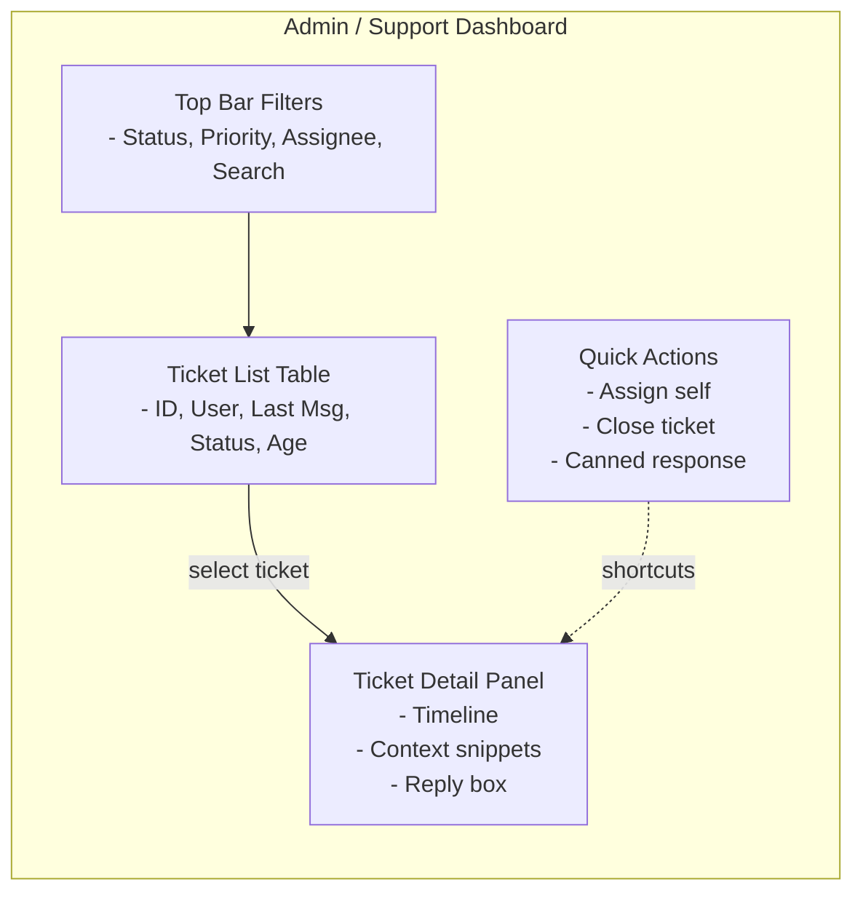

# AI-Deskhelp Wireframes

## Chat Screen (Main Interface)
```mermaid
flowchart TB
    subgraph CHAT[Chat Screen]
        direction TB
        H[Header: AI-Deskhelp, user status, logout]
        M[Message Pane<br/>- User bubbles<br/>- AI/RAG bubbles<br/>- Escalation banner]
        I[Input Row<br/>- Text box<br/>- Send button<br/>- (optional) Attach]
        F[Footer hints: "AI may escalate to human if unsure"]
        H --> M --> I
        F -. static note .-> I
    end
```

## Ticket Escalation Screen
```mermaid
flowchart TB
    subgraph TICKET[Ticket Escalation]
        direction TB
        TH[Header: Ticket #123 • Status (Open/Pending/Closed)]
        SUM[Summary Card<br/>- User question<br/>- Auto-captured context/FAQ snippets]
        TL[Timeline<br/>- User msgs<br/>- AI attempts + confidence<br/>- Escalation event]
        ACT[Actions<br/>- Add comment<br/>- Upload file<br/>- Mark resolved]
        META[Meta<br/>- Priority<br/>- Assignee<br/>- SLA note]
        TH --> SUM --> TL --> ACT
        META -. side info .-> SUM
    end
```

## Admin / Support Dashboard (Optional)


## Interaction Notes
- Chat: user types → send → message appears; if low confidence, show escalation banner with ticket link.
- Escalation: timeline shows AI attempts; agent comments or resolves via actions; status syncs back to chat.
- Admin: filter/search tickets; selecting a row opens detail; quick actions handle assignment/closure.

## Angular Component Structure (MVP)
- `AppComponent`
  - `NavbarComponent` (logo/user status)
  - `RouterOutlet`
- `ChatPageComponent`
  - `ChatHeaderComponent`
  - `MessageListComponent`
    - `MessageBubbleComponent` (user/ai variants)
    - `EscalationBannerComponent` (ticket link)
  - `ChatInputComponent`
- `TicketPageComponent`
  - `TicketHeaderComponent`
  - `TicketSummaryComponent`
  - `TicketTimelineComponent`
    - `TimelineItemComponent`
  - `TicketActionsComponent`
  - `TicketMetaComponent`
- `AdminDashboardComponent` (optional)
  - `TicketFiltersComponent`
  - `TicketTableComponent`
    - `TicketRowComponent`
  - `TicketDetailComponent`
    - shares `TicketTimelineComponent`, `TicketActionsComponent`
    - `ContextSnippetsComponent`
    - `ReplyBoxComponent`
