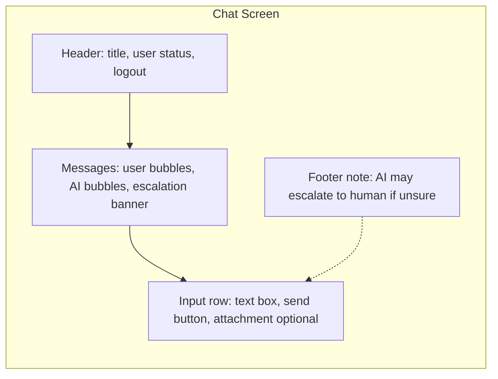
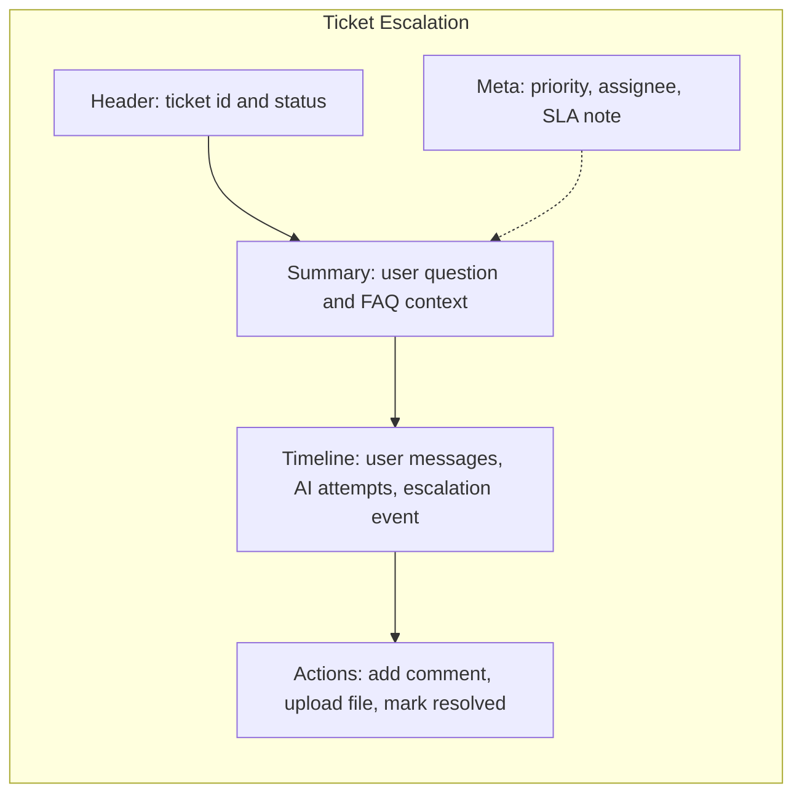
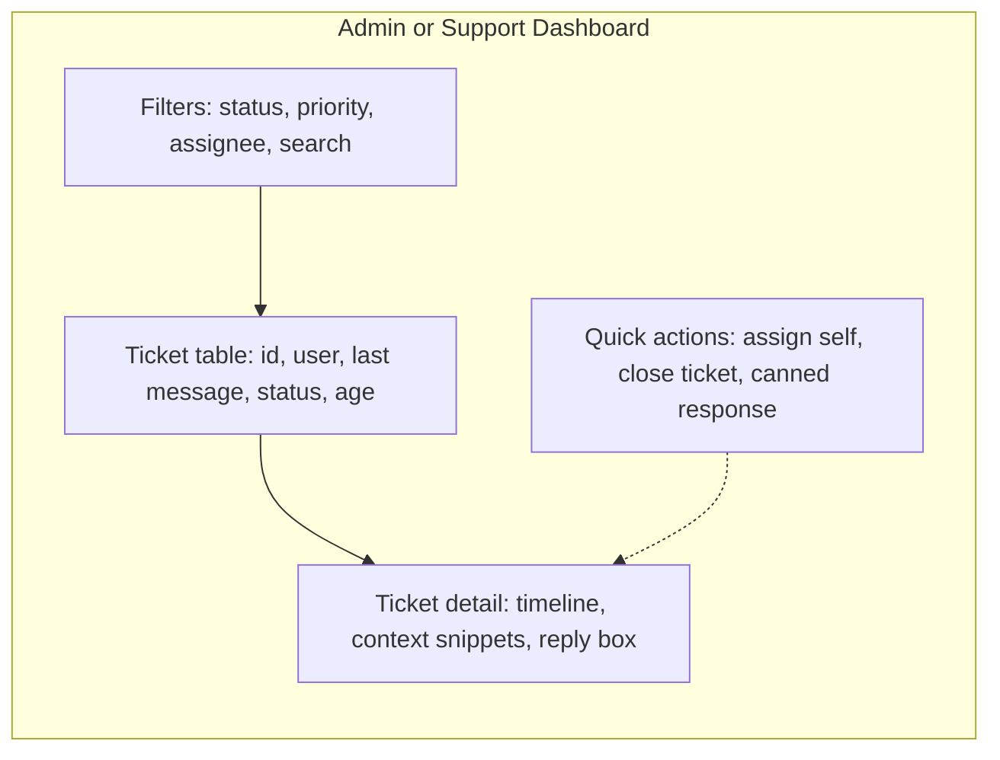

# AI-Deskhelp Wireframes

## Chat Screen (Main Interface)

## Ticket Escalation Screen

## Admin / Support Dashboard (Optional)

## Interaction Notes
- Chat: user types → send → message appears; if low confidence, show escalation banner with ticket link.
- Escalation: timeline shows AI attempts; agent comments or resolves via actions; status syncs back to chat.
- Admin: filter/search tickets; selecting a row opens detail; quick actions handle assignment/closure.

## Angular Component Structure (MVP)
- `AppComponent`
  - `NavbarComponent` (logo/user status)
  - `RouterOutlet`
- `ChatPageComponent`
  - `ChatHeaderComponent`
  - `MessageListComponent`
    - `MessageBubbleComponent` (user/ai variants)
    - `EscalationBannerComponent` (ticket link)
  - `ChatInputComponent`
- `TicketPageComponent`
  - `TicketHeaderComponent`
  - `TicketSummaryComponent`
  - `TicketTimelineComponent`
    - `TimelineItemComponent`
  - `TicketActionsComponent`
  - `TicketMetaComponent`
- `AdminDashboardComponent` (optional)
  - `TicketFiltersComponent`
  - `TicketTableComponent`
    - `TicketRowComponent`
  - `TicketDetailComponent`
    - shares `TicketTimelineComponent`, `TicketActionsComponent`
    - `ContextSnippetsComponent`
    - `ReplyBoxComponent`
